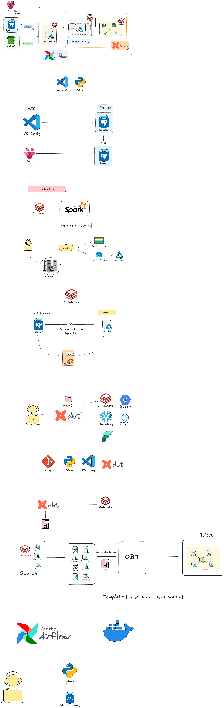

# Walmart Data Engineering Project

A production-style end-to-end data pipeline that ingests retail transactional data from a Databricks lakehouse, transforms it through a multi-layer dbt project (Bronze → Silver → Gold), and serves a star-schema data warehouse — all orchestrated by Apache Airflow running in Docker.

---

## Table of Contents

- [Architecture Overview](#architecture-overview)
- [Tech Stack](#tech-stack)
- [Project Structure](#project-structure)
- [Data Flow](#data-flow)
- [dbt Layers](#dbt-layers)
  - [Bronze (Sources)](#bronze-sources)
  - [Silver Technical](#silver-technical)
  - [Silver Business (OBT)](#silver-business-obt)
  - [Gold Ephemeral](#gold-ephemeral)
  - [Gold Dimensions (SCD Type 2)](#gold-dimensions-scd-type-2)
  - [Gold Fact Table](#gold-fact-table)
- [Airflow DAG](#airflow-dag)
- [Docker Setup](#docker-setup)
- [Getting Started](#getting-started)
- [Configuration](#configuration)
- [Source Dataset](#source-dataset)

---

## Architecture Overview



```
CSV Files (walmart_dataset/data/)
        │
        └──► load_data.py (psycopg2 COPY) ──► raw schema (initial seed)
                                                      │
                                                      ▼
                                           Databricks CDC Job
                                           (triggered by Airflow)
                                                      │
                                                      ▼
                                           walmart.bronze (6 tables)
                                                      │
                                           [dbt source freshness check]
                                                      │
                                                      ▼
                                           walmart.silver_t (6 incremental tables)
                                           — CDC watermark on updated_timestamp
                                                      │
                                                      ▼
                                           walmart.silver_b.obt_b (One Big Table)
                                           — All 6 entities joined
                                                      │
                                   ┌──────────────────┴─────────────────────┐
                                   ▼                                         ▼
                        Gold Ephemeral Models                         fact_orders
                        (eph_customers, eph_employees,                (walmart.gold)
                         eph_orders, eph_products, eph_stores)
                                   │
                                   ▼
                        dbt Snapshots — SCD Type 2
                        dim_customers, dim_employees, dim_orders,
                        dim_products, dim_stores
                        (walmart.gold)
```

---

## Tech Stack

| Component | Technology |
|---|---|
| Orchestration | Apache Airflow 3.2.0 (CeleryExecutor) |
| Transformation | dbt-core ≥1.11, dbt-databricks ≥1.12 |
| Data Platform | Databricks (Unity Catalog) |
| CDC / Ingestion | Databricks Jobs via `databricks-sdk` |
| Message Broker | Redis 7.2 |
| Metadata Database | PostgreSQL 16 |
| Containerization | Docker + Docker Compose |
| Language | Python 3, SQL (Jinja-templated) |

---

## Project Structure

```
Walmart_Airflow_DBT_Project/
├── Notes.png                              # Architecture diagram
├── README.md                              # This file
│
├── walmart_dataset/                       # Source data & DDL
│   ├── data/                              # Raw CSV files (6 entities)
│   │   ├── customers.csv
│   │   ├── employees.csv
│   │   ├── orders.csv
│   │   ├── order_items.csv
│   │   ├── products.csv
│   │   └── stores.csv
│   ├── ddl/walmart_schema.sql             # DDL for all source tables
│   └── load_data.py                       # Initial CSV → DB loader (psycopg2)
│
└── airflow_dbt_project/                   # Main pipeline project
    ├── .env                               # AIRFLOW_UID setting
    ├── Dockerfile                         # Custom Airflow image
    ├── docker-compose.yaml                # Full 8-service stack
    ├── requirements.txt                   # Python dependencies
    ├── config/airflow.cfg                 # Airflow configuration
    ├── dags/
    │   └── orchestrate.py                 # Single pipeline DAG (10 tasks)
    └── walmart_project/                   # dbt project
        ├── dbt_project.yml                # Project config & materialization settings
        ├── profiles.yml                   # Databricks connection profile
        ├── macros/
        │   └── custom_schema.sql          # Schema name override macro
        ├── models/
        │   ├── source/sources.yml         # Bronze source declarations
        │   ├── silver_t/                  # 6 incremental silver models
        │   │   ├── customers_t.sql
        │   │   ├── employees_t.sql
        │   │   ├── orders_t.sql
        │   │   ├── order_items_t.sql
        │   │   ├── products_t.sql
        │   │   └── stores_t.sql
        │   ├── silver_b/
        │   │   └── obt_b.sql              # One Big Table (all 6 entities joined)
        │   └── gold/
        │       ├── ephemeral/             # 5 ephemeral staging models
        │       │   ├── eph_customers.sql
        │       │   ├── eph_employees.sql
        │       │   ├── eph_orders.sql
        │       │   ├── eph_products.sql
        │       │   └── eph_stores.sql
        │       └── fact/
        │           └── fact_orders.sql    # Grain-level fact table
        ├── snapshots/                     # SCD Type 2 dimension definitions
        │   ├── dim_customers.yml
        │   ├── dim_employees.yml
        │   ├── dim_orders.yml
        │   ├── dim_products.yml
        │   └── dim_stores.yml
        └── tests/                         # Data quality tests
```

---

## Data Flow

### 1. Initial Seed
`load_data.py` uses `psycopg2` to bulk-load the 6 CSV files from `walmart_dataset/data/` into a raw database schema via `COPY ... FROM STDIN`. This is a one-time seeding step.

### 2. CDC Ingestion
A Databricks job reads from the raw source, applies Change Data Capture logic, and writes into `walmart.bronze`. This job is triggered directly by Airflow using the `databricks-sdk`.

### 3. dbt Transformations
dbt transforms the data through Silver and Gold layers, applying incremental merges, business joins, SCD Type 2 snapshots, and fact table construction.

---

## dbt Layers

### Bronze (Sources)

Declared in `models/source/sources.yml`. These are **not dbt models** — they are references to pre-existing tables populated by the Databricks CDC job.

- Catalog: `walmart`, Schema: `bronze`
- Tables: `orders`, `customers`, `products`, `order_items`, `stores`, `employees`
- Each table carries `created_timestamp`, `updated_timestamp`, and `is_active` CDC columns

---

### Silver Technical

- Schema: `walmart.silver_t`
- Materialization: **incremental**
- 6 models (one per entity): `customers_t`, `employees_t`, `orders_t`, `order_items_t`, `products_t`, `stores_t`

Each model follows a CDC watermark pattern:

```sql
SELECT *, current_timestamp() AS processed_at
FROM {{ source('bronze', '<table>') }}

WHERE updated_timestamp > (
    SELECT COALESCE(MAX(updated_timestamp), '1900-01-01') FROM {{ this }}
)

```

Only new or updated rows from bronze are merged on each run, making the pipeline efficient and idempotent.

Data tests defined in `properties.yml`:
- `products_t.product_id` — `not_null`, `unique` (filtered to `price > 0`)
- `orders_t.order_id` — `not_null`, `unique`

---

### Silver Business (OBT)

- Schema: `walmart.silver_b`
- Materialization: **table** (full refresh)
- Model: `obt_b.sql`

A Jinja-driven **One Big Table** that joins all 6 Silver Technical tables into a single wide table:

```
orders_t (base)
  LEFT JOIN customers_t   ON customer_id
  LEFT JOIN order_items_t ON order_id
  LEFT JOIN products_t    ON product_id
  LEFT JOIN employees_t   ON store_id
  LEFT JOIN stores_t      ON store_id
```

Column aliases are applied per entity (e.g., `customer_first_name`, `order_status`) to avoid name collisions. This OBT is the single source for all downstream Gold models.

---

### Gold Ephemeral

- Materialization: **ephemeral** (compiled inline, no physical table)
- 5 models: `eph_customers`, `eph_employees`, `eph_orders`, `eph_products`, `eph_stores`

Each model uses `SELECT DISTINCT` on entity-specific columns from `ref('obt_b')` and adds a `*_gold_processed_at` audit timestamp. These serve as clean, de-duplicated inputs to the SCD2 snapshot definitions.

---

### Gold Dimensions (SCD Type 2)

- Schema: `walmart.gold`
- Strategy: **timestamp** (dbt snapshots)
- 5 dimension tables

| Snapshot | Source | Unique Key | Tracked Column |
|---|---|---|---|
| `dim_customers` | `eph_customers` | `customer_id` | `customer_updated_timestamp` |
| `dim_employees` | `eph_employees` | `employee_id` | `employee_updated_timestamp` |
| `dim_orders` | `eph_orders` | `order_id` | `order_updated_timestamp` |
| `dim_products` | `eph_products` | `product_id` | `product_updated_timestamp` |
| `dim_stores` | `eph_stores` | `store_id` | `store_updated_timestamp` |

All snapshots use `dbt_valid_to_current: "to_date('9999-12-31')"` so active records display `9999-12-31` in the `dbt_valid_to` column instead of NULL — a standard SCD2 convention.

---

### Gold Fact Table

- Schema: `walmart.gold`
- Materialization: **table**
- Model: `fact_orders.sql`

Grain: one row per order line item. Columns:

```
order_id, order_item_id, product_id, store_id, employee_id, customer_id,
total_amount, quantity, unit_price, line_amount
```

---

## Airflow DAG

DAG ID: `orchestrate` — a single linear pipeline with 10 tasks.

```
ingest_cdc
    │
    ▼
clean_target
    │
    ▼
source_freshness
    │
    ▼
silver_technical
    │
    ▼
silver_technical_tests
    │
    ▼
silver_business
    │
    ▼
silver_business_tests
    │
    ▼
gold_ephermeral
    │
    ▼
gold_dimensions
    │
    ▼
gold_facts
```

| Task | Type | Description |
|---|---|---|
| `ingest_cdc` | Python | Triggers a Databricks CDC job via `WorkspaceClient.jobs.run_now()`, polls every 5s until terminal state |
| `clean_target` | Bash | Deletes dbt `target/` and `logs/` directories to ensure a clean compilation state |
| `source_freshness` | Bash | Runs `dbt source freshness` to validate bronze tables have recent data |
| `silver_technical` | Bash | `dbt run --select silver_t` — builds all 6 incremental silver models |
| `silver_technical_tests` | Bash | `dbt test --select silver_t` — data quality gate before proceeding |
| `silver_business` | Bash | `dbt run --select silver_b` — builds the One Big Table |
| `silver_business_tests` | Bash | `dbt test --select silver_b` — data quality gate on OBT |
| `gold_ephermeral` | Bash | `dbt run --select gold/ephermeral` — evaluates ephemeral models |
| `gold_dimensions` | Bash | `dbt snapshot` — runs all 5 SCD Type 2 snapshot definitions |
| `gold_facts` | Bash | `dbt run --select gold/fact` — builds the grain-level fact table |

---

## Docker Setup

The project runs on a standard **CeleryExecutor** Airflow stack defined in `docker-compose.yaml`.

### Services

| Service | Image | Port |
|---|---|---|
| `postgres` | postgres:16 | — |
| `redis` | redis:7.2-bookworm | — |
| `airflow-apiserver` | custom (Dockerfile) | 8080 |
| `airflow-scheduler` | custom (Dockerfile) | — |
| `airflow-dag-processor` | custom (Dockerfile) | — |
| `airflow-worker` | custom (Dockerfile) | — |
| `airflow-triggerer` | custom (Dockerfile) | — |
| `airflow-init` | custom (Dockerfile) | — |
| `flower` *(optional)* | custom (Dockerfile) | 5555 |

The custom image (`Dockerfile`) is based on `apache/airflow:3.2.0` and installs all dependencies from `requirements.txt`.

### Volume Mounts (all Airflow services)

| Host Path | Container Path |
|---|---|
| `./dags` | `/opt/airflow/dags` |
| `./logs` | `/opt/airflow/logs` |
| `./config` | `/opt/airflow/config` |
| `./plugins` | `/opt/airflow/plugins` |
| `./walmart_project` | `/opt/airflow/walmart_project` |

---

## Getting Started

### Prerequisites

- Docker and Docker Compose installed
- A Databricks workspace with a SQL warehouse and a configured CDC job
- Git

### 1. Clone the repository

```bash
git clone https://github.com/Abhijeet-dev-05/DataEngineeringProject.git
cd DataEngineeringProject/airflow_dbt_project
```

### 2. Configure credentials

Update the following files with your actual credentials (do not commit secrets):

**`walmart_project/profiles.yml`**
```yaml
walmart_project:
  target: dev
  outputs:
    dev:
      type: databricks
      catalog: walmart
      host: <your-databricks-workspace-url>
      http_path: <your-sql-warehouse-http-path>
      token: <your-databricks-pat>
      schema: dbt_schema
      threads: 1
```

**`dags/orchestrate.py`** — update the `WorkspaceClient` configuration:
```python
host  = "<your-databricks-workspace-url>"
token = "<your-databricks-pat>"
job_id = <your-cdc-job-id>
```

### 3. Set environment variables

```bash
echo "AIRFLOW_UID=$(id -u)" > .env
```

### 4. Initialize Airflow

```bash
docker compose up airflow-init
```

### 5. Start all services

```bash
docker compose up -d
```

Airflow UI will be available at **http://localhost:8080**  
Default credentials: `airflow` / `airflow`

### 6. (Optional) Start Flower monitoring

```bash
docker compose --profile flower up -d
```

Flower UI: **http://localhost:5555**

### 7. (Optional) Seed the source database

If you need to load the CSV data into the raw schema for the first time:

```bash
python walmart_dataset/load_data.py
```

---

## Configuration

### dbt Schema Routing

The `macros/custom_schema.sql` macro overrides dbt's default behavior. When a `+schema` is set in `dbt_project.yml`, that schema name is used **as-is** (no `<default_schema>_` prefix). This ensures models land in the correct schemas:

| dbt Layer | Databricks Schema |
|---|---|
| silver_t models | `walmart.silver_t` |
| silver_b models | `walmart.silver_b` |
| gold models & snapshots | `walmart.gold` |

### Materialization Summary

| Layer | Materialization |
|---|---|
| Silver Technical | incremental |
| Silver Business | table |
| Gold Ephemeral | ephemeral |
| Gold Dimensions | snapshot (SCD2) |
| Gold Fact | table |

---

## Source Dataset

Six CSV files in `walmart_dataset/data/` represent the Walmart retail domain:

| File | Description |
|---|---|
| `customers.csv` | Customer demographics and contact info |
| `employees.csv` | Employee records linked to stores |
| `orders.csv` | Order header records |
| `order_items.csv` | Order line items (grain of the fact table) |
| `products.csv` | Product catalog with pricing |
| `stores.csv` | Store locations and details |

All source tables include `created_timestamp`, `updated_timestamp`, and `is_active` columns to support Change Data Capture patterns.

